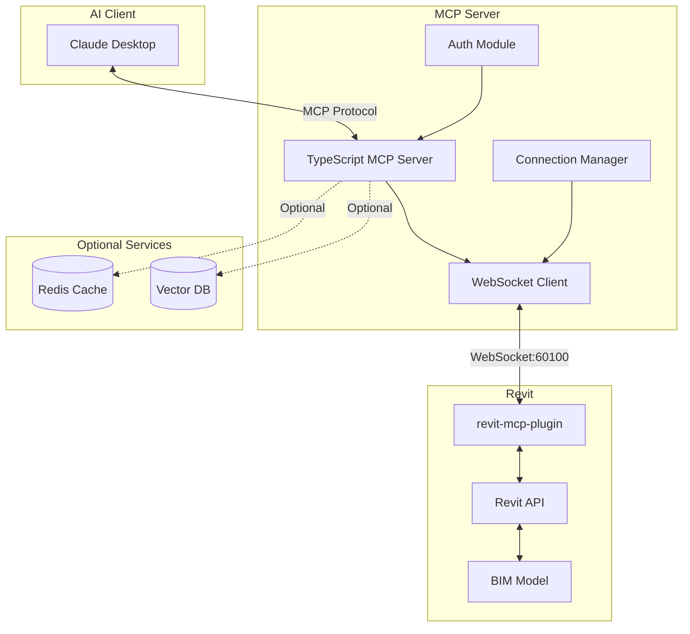

# 🏗️ Revit MCP Server

[](https://www.npmjs.com/package/revit-mcp)
[](https://www.npmjs.com/package/revit-mcp)
[](https://opensource.org/licenses/MIT)
[](https://www.typescriptlang.org/)
[](https://modelcontextprotocol.io)
[](https://nodejs.org)
[](https://github.com/espocorp/revit-mcp)
[](https://github.com/espocorp/revit-mcp/issues)

**AI-Powered Revit Automation through Model Context Protocol**

A TypeScript implementation of an MCP (Model Context Protocol) server for Autodesk Revit, enabling AI assistants like Claude to interact with and automate Revit through natural language conversations.

## 🌟 Features

- 🤖 **AI-Native Integration**: Built specifically for AI assistants to understand and manipulate Revit models
- 🔧 **Comprehensive Tool Set**: 20+ specialized tools for creating, modifying, and analyzing Revit elements
- 🏢 **Advanced Automation**: Elevator systems, floor duplication, and intelligent element operations
- 🔍 **Smart Filtering**: AI-powered element querying with natural language understanding
- 🔐 **Secure Code Execution**: Validated and sandboxed code execution environment
- ⚡ **Real-time Communication**: WebSocket-based connection for instant feedback
- 📊 **Optional Caching**: Redis integration for performance optimization
- 🎯 **Type-Safe**: Full TypeScript implementation with comprehensive type definitions

## 📋 Requirements

- Node.js 18+ 
- Autodesk Revit with [revit-mcp-plugin](https://github.com/revit-mcp/revit-mcp-plugin) installed
- Claude Desktop or any MCP-compatible client

## 🚀 Quick Start

### Installation

```bash
# Clone the repository
git clone https://github.com/espocorp/revit-mcp.git
cd revit-mcp

# Install dependencies
npm install

# Build the project
npm run build
```

### Configuration

Add to your Claude Desktop configuration (`claude_desktop_config.json`):

```json
{
  "mcpServers": {
    "revit-mcp": {
      "command": "node",
      "args": ["<path-to-project>/build/index.js"]
    }
  }
}
```

### Environment Variables (Optional)

Create a `.env` file for advanced features:

```env
# Security
REVIT_MCP_API_KEY=your-secure-api-key

# Redis (optional - for caching)
REDIS_PASSWORD=your-redis-password

# ChromaDB (optional - for vector search)
CHROMA_AUTH_TOKEN=your-chroma-token
```

## 🛠️ Available Tools

### Core Element Operations

| Tool | Description |
|------|-------------|
| `get_current_view_info` | Retrieve information about the active Revit view |
| `get_current_view_elements` | List all elements visible in the current view |
| `get_selected_elements` | Get details of currently selected elements |
| `get_available_family_types` | List all family types available in the project |

### Element Creation

| Tool | Description |
|------|-------------|
| `create_point_based_element` | Place elements at specific points (doors, windows, furniture) |
| `create_line_based_element` | Create linear elements (walls, beams, pipes) |
| `create_surface_based_element` | Generate surface elements (floors, ceilings, roofs) |
| `createWall` | Specialized wall creation with detailed parameters |

### Element Modification

| Tool | Description |
|------|-------------|
| `modify_element` | Update element properties and parameters |
| `delete_element` | Remove elements from the model |
| `operate_element` | Perform operations (hide, isolate, select) |
| `color_elements` | Apply color overrides based on parameter values |

### Advanced Features

| Tool | Description |
|------|-------------|
| `ai_element_filter` | Intelligent element querying with natural language |
| `duplicate_floor_elements` | Replicate entire floor layouts with smart filtering |
| `elevator_automation` | Complete elevator system design and placement |
| `tag_all_walls` | Automatically tag walls in views |
| `send_code_to_revit_secure` | Execute validated C# code in Revit |

### Module System

| Tool | Description |
|------|-------------|
| `search_modules` | Find available automation modules |
| `use_module` | Execute pre-built automation modules |

## 🏗️ Architecture



## 📦 Development

### Scripts

```bash
# Development
npm run dev          # Watch mode for development
npm run build        # Build the project
npm run test         # Run tests
npm run lint         # Lint code
npm run format       # Format code

# Docker Services (Optional)
npm run docker:up    # Start Redis & ChromaDB
npm run docker:down  # Stop services
npm run docker:logs  # View service logs
```

### Project Structure

```
revit-mcp/
├── src/
│   ├── index.ts              # Main entry point
│   ├── tools/                # MCP tool implementations
│   │   ├── ai_element_filter.ts
│   │   ├── elevator_automation.ts
│   │   └── ...
│   ├── utils/                # Utility modules
│   │   ├── ConnectionManager.ts
│   │   ├── SocketClient.ts
│   │   ├── auth.ts
│   │   └── ...
│   └── types/                # TypeScript definitions
│       └── revit.ts
├── __tests__/                # Test files
├── docker-compose.yml        # Optional services
├── package.json
└── tsconfig.json
```

## 🔒 Security

This MCP server implements multiple security layers:

- **API Key Authentication**: Secure tool access with API keys
- **Code Validation**: Sandboxed execution environment for custom code
- **Pattern Blacklisting**: Prevents execution of dangerous code patterns
- **Rate Limiting**: Built-in protection against abuse
- **Secure WebSocket**: Encrypted communication with Revit

## 🧪 Testing

```bash
# Run all tests
npm test

# Watch mode
npm run test:watch

# Coverage report
npm run test:coverage

# Integration tests
npm run test:integration
```

## 📖 Example Usage

Once configured, you can interact with Revit through Claude:

```
User: "Create a 10-foot wall at the origin"
Claude: I'll create a wall for you using the Revit MCP tools...
[Creates wall in Revit]

User: "Find all doors in the current view"
Claude: Let me query the elements in your current view...
[Returns list of doors with properties]

User: "Duplicate the 3rd floor layout to the 5th floor"
Claude: I'll help you duplicate the floor elements...
[Copies all elements with intelligent filtering]
```

## 🤝 Contributing

We welcome contributions! Please see our [Contributing Guide](CONTRIBUTING.md) for details.

1. Fork the repository
2. Create your feature branch (`git checkout -b feature/AmazingFeature`)
3. Commit your changes (`git commit -m 'Add some AmazingFeature'`)
4. Push to the branch (`git push origin feature/AmazingFeature`)
5. Open a Pull Request

## 📄 License

This project is licensed under the MIT License - see the [LICENSE](LICENSE) file for details.

## 🙏 Acknowledgments

- [Model Context Protocol](https://modelcontextprotocol.io) by Anthropic
- [revit-mcp-plugin](https://github.com/revit-mcp/revit-mcp-plugin) - Revit plugin component
- [revit-mcp-commandset](https://github.com/revit-mcp/revit-mcp-commandset) - Command implementations

## 🔗 Related Projects

- **revit-mcp-plugin**: Revit plugin for receiving and executing commands
- **revit-mcp-commandset**: Extensible command sets for Revit operations
- **revit-mcp-python**: Python implementation (alternative)
- **revit-mcp-dotnet**: .NET implementation (alternative)

## 📞 Support

- 🐛 [Report Issues](https://github.com/espocorp/revit-mcp/issues)
- 💬 [Discussions](https://github.com/espocorp/revit-mcp/discussions)
- 📧 [Email Support](mailto:support@espocorp.com)
- 🌐 [Project Website](https://revit-mcp.com)

## 🚦 Status


---

<div align="center">
  <strong>Built with ❤️ by ESPO Corporation</strong>
  <br>
  <sub>Empowering AEC professionals with AI-driven automation</sub>
</div>