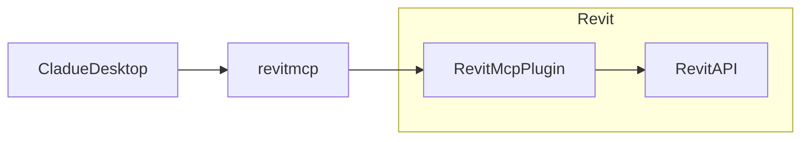

# revit-mcp

English | [简体中文](README_zh.md)

## description

revit-mcp is a tool that allows you to interact with Revit using the MCP protocol.

## implementation framework

#### Tools

- `create_object` - Create a new object with detailed parameters
- `delete_object` - Remove an object from view
- `modify_object` - Modify an existing object's properties