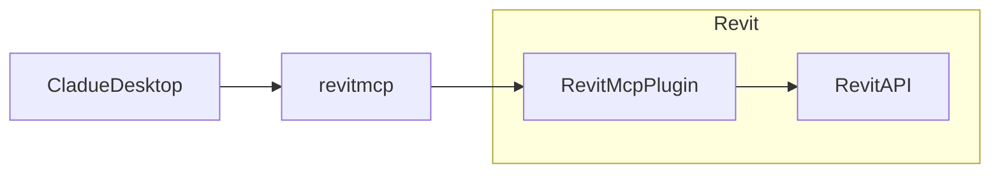

# revit-mcp

<<<<<<< Updated upstream
=======
English | [简体中文](README_zh.md)

## description

revit-mcp allows you to interact with Revit using the MCP protocol.

This project is the server side (providing Tools to AI), and you need to use [revit-mcp-plugin](https://github.com/revit-mcp/revit-mcp-plugin) (driving Revit) in conjunction.

## features

- Allow AI to get data from the Revit project
- Allow AI to drive Revit to create, modify, and delete elements
- Send code to Revit to execute (may not be successful, successful rate is higher in some simple scenarios with clear requirements)

## installation

### environment requirements

- nodejs 18+

> Complete installation environment still needs to consider the needs of revit-mcp-plugin, please refer to [revit-mcp-plugin](https://github.com/revit-mcp/revit-mcp-plugin)

### installation process

1. Install dependencies

```bash
npm install
```

2. Build

```bash
npm run build
```

3. Configure the claude client

Claude client -> Settings > Developer > Edit Config > claude_desktop_config.json

```json
{
    "mcpServers": {
        "revit-mcp": {
            "command": "node",
            "args": ["<path to the built file>\\build\\index.js"]
        }
    }
}
```

Restart the claude client

4. Start the communication in revit through the revit-mcp-plugin plugin

## implementation framework



>>>>>>> Stashed changes
#### Tools

| Name                      | Description                               |
| ------------------------- | ---------------------------------- |
| get_current_view_info     | get current view info              |
| get_current_view_elements | get current view elements          |
| create_element            | create new element(wall, door, window, floor) |
| delete_element            | delete element                      |
| modify_element            | modify element's properties(instance parameters)         |
| search_modules            | search for available modules          |
| use_module                | use module                           |
| send_code_to_revit        | send code to revit to execute         |
