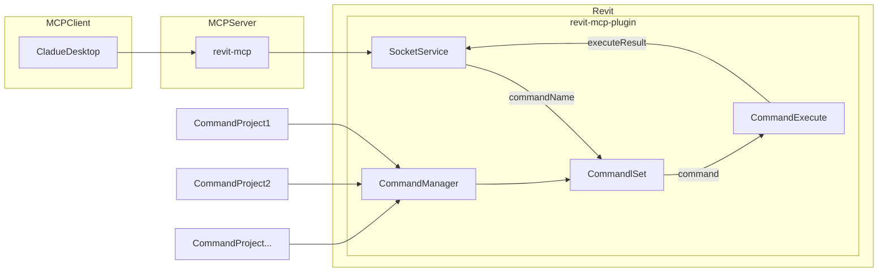

[](https://mseep.ai/app/revit-mcp-revit-mcp)

# revit-mcp

English | [简体中文](README_zh.md)

## Description

revit-mcp allows you to interact with Revit using the MCP protocol through MCP-supported clients (such as Claude, Cline, etc.).

This project is the server side (providing Tools to AI), and you need to use [revit-mcp-plugin](https://github.com/revit-mcp/revit-mcp-plugin) (driving Revit) in conjunction.

Join [Discord](https://discord.gg/cGzUGurq) | [QQ Group](http://qm.qq.com/cgi-bin/qm/qr?_wv=1027&k=kLnQiFVtYBytHm7R58KFoocd3mzU_9DR&authKey=fyXDOBmXP7FMkXAWjddWZumblxKJH7ZycYyLp40At3t9%2FOfSZyVO7zyYgIROgSHF&noverify=0&group_code=792379482)

## Features

- Allow AI to get data from the Revit project
- Allow AI to drive Revit to create, modify, and delete elements
- Send AI-generated code to Revit to execute (may not be successful, successful rate is higher in some simple scenarios with clear requirements)

## Requirements

- nodejs 18+

> Complete installation environment still needs to consider the needs of revit-mcp-plugin, please refer to [revit-mcp-plugin](https://github.com/revit-mcp/revit-mcp-plugin)

## Installation

### 1. Build local MCP service

Install dependencies

```bash
npm install
```

Build

```bash
npm run build
```

### 2. Client configuration

**Claude client**

Claude client -> Settings > Developer > Edit Config > claude_desktop_config.json

```json
{
    "mcpServers": {
        "revit-mcp": {
            "command": "node",
            "args": ["<path to the built file>\\build\\index.js"]
        }
    }
}
```

Restart the Claude client. When you see the hammer icon, it means the connection to the MCP service is normal.


## Framework



## Supported Tools

| Name                      | Description                               |
| ------------------------- | ----------------------------------------- |
| get_current_view_info     | Get current view info                     |
| get_current_view_elements | Get current view elements                 |
| get_available_family_types | Get available family types in current project |
| get_selected_elements      | Get selected elements                      |
| create_point_based_element  | Create point based element (door, window, furniture) |
| create_line_based_element   | Create line based element (wall, beam, pipe) |
| create_surface_based_element   | Create surface based element (floor, ceiling) |
| delete_elements             | Delete elements                            |
| reset_model                | Reset model (delete process model when executing continuous dialog) |
| modify_element             | Modify element's properties (instance parameters) |
| search_modules             | Search for available modules              |
| use_module                 | Use module                                |
| send_code_to_revit         | Send code to Revit to execute             |
| color_splash		     | Color elements based on a parameter value	|
| tag_walls		     | Tag all walls in view            |
