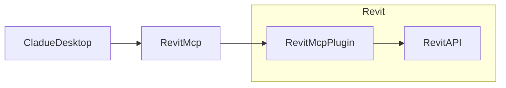

# revit-mcp

[English](README.md) | 简体中文

## 简介

revit-mcp 允许你使用claude客户端通过 MCP 协议与 Revit 进行交互。

本项目是服务端（向AI提供Tools），还需要配合[revit-mcp-plugin](https://github.com/revit-mcp/revit-mcp-plugin)（驱动Revit）使用。

## 特性

- 允许AI获取Revit项目中的数据
- 允许AI驱动Revit创建、修改、删除元素
- 将AI生成的代码发送到Revit中执行（有可能不成功，在一些需求明确的简单场景下成功率较高）

## 安装

### 环境要求

- nodejs 18+

> 完整的安装环境仍需考虑revit-mcp-plugin的需求，请参考[revit-mcp-plugin](https://github.com/revit-mcp/revit-mcp-plugin)

### 安装流程

1. 安装依赖

```bash
npm install
```

2. 构建

```bash
npm run build
```

3. 配置claude客户端

Claude客户端->Settings > Developer > Edit Config > claude_desktop_config.json

``` json
{
    "mcpServers": {
        "revit-mcp": {
            "command": "node",
            "args": [
                "<替换为构件后的路径>\\build\\index.js"
            ]
        }
    }
}
```

重启Claude客户端

4. 在revit中通过revit-mcp-plugin插件启动通讯

## 实现框架



## 支持的Tools

| 名称                      | 说明                               |
| ------------------------- | ---------------------------------- |
| get_current_view_info     | 获得当前视图信息                   |
| get_current_view_elements | 获得当前视图的元素                 |
| create_element            | 创建新元素（支持墙、门、窗、楼板） |
| delete_element            | 删除元素                           |
| modify_element            | 修改元素的属性（实例参数）         |
| search_modules            | 搜索可用模块                       |
| use_module                | 使用模块                           |
| send_code_to_revit        | 发送代码到Revit中执行              |
