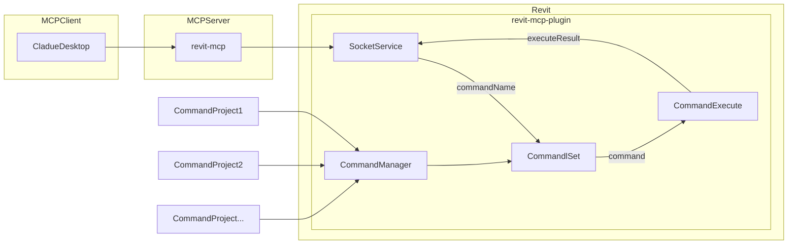

# revit-mcp

[English](README.md) | 简体中文

## 简介

revit-mcp 允许你通过支持mcp server的客户端（例如cladue、cline等）通过 MCP 协议与 Revit 进行交互。

本项目是服务端（向AI提供Tools），还需要配合[revit-mcp-plugin](https://github.com/revit-mcp/revit-mcp-plugin)（驱动Revit）使用。

加入我们 [Discord](https://discord.gg/cGzUGurq) | [QQ群](http://qm.qq.com/cgi-bin/qm/qr?_wv=1027&k=kLnQiFVtYBytHm7R58KFoocd3mzU_9DR&authKey=fyXDOBmXP7FMkXAWjddWZumblxKJH7ZycYyLp40At3t9%2FOfSZyVO7zyYgIROgSHF&noverify=0&group_code=792379482)

## 特性

- 允许AI获取Revit项目中的数据
- 允许AI驱动Revit创建、修改、删除元素
- 将AI生成的代码发送到Revit中执行（有可能不成功，在一些需求明确的简单场景下成功率较高）

## 环境要求

- nodejs 18+

> 完整的安装环境仍需考虑revit-mcp-plugin的需求，请参考[revit-mcp-plugin](https://github.com/revit-mcp/revit-mcp-plugin)

## 安装流程

### 1. 本地mcp服务构建

安装依赖

```bash
npm install
```

构建

```bash
npm run build
```

### 2. 客户端配置

**claude客户端**

Claude客户端->Settings > Developer > Edit Config > claude_desktop_config.json

``` json
{
    "mcpServers": {
        "revit-mcp": {
            "command": "node",
            "args": [
                "<替换为构件后的路径>\\build\\index.js"
            ]
        }
    }
}
```

重启Claude客户端，看到小锤子则正常连接到mcp服务


## 实现框架



## 支持的Tools

| 名称                       | 说明                               |
| -------------------------- | ---------------------------------- |
| get_current_view_info      | 获得当前视图信息                   |
| get_current_view_elements  | 获得当前视图的元素                 |
| get_available_family_types | 获得当前项目中可以使用的族类型         |
| get_selected_elements      | 获得选中的元素                         |
| create_point_based_element  | 创建点式元素（例如门、窗、家具等） |
| create_line_based_element   | 创建线式元素（例如墙、梁、管道等） |
| create_surface_based_element   | 创建面状元素（例如地板、天花板等） |
| delete_elements             | 删除元素                           |
| reset_model                | 重置模型(在执行连续对话时，删除过程模型) |
| modify_element             | 修改元素的属性（实例参数）         |
| search_modules             | 搜索可用模块                       |
| use_module                 | 使用模块                           |
| send_code_to_revit         | 发送代码到Revit中执行              |
| color_splash		     | 基于参数值对元素进行着色 |
| tag_walls		     | 在视图中标记所有墙体 |

