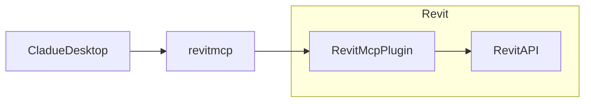

# revit-mcp

[English](README.md) | 简体中文

## 简介

revit-mcp 允许你使用claude客户端通过 MCP 协议与 Revit 进行交互。

## 实现框架

## 支撑的Tools

- `create_object` - 创建一个新对象
- `delete_object` - 删除一个对象
- `modify_object` - 修改一个对象的属性

